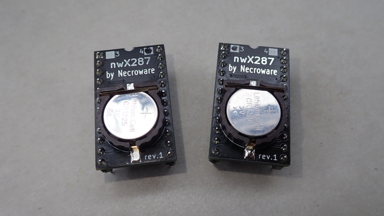
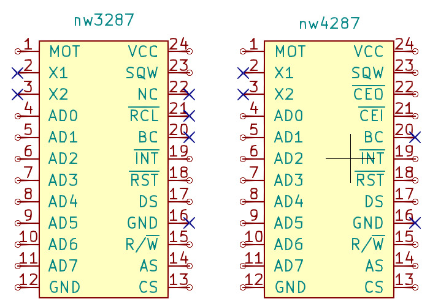
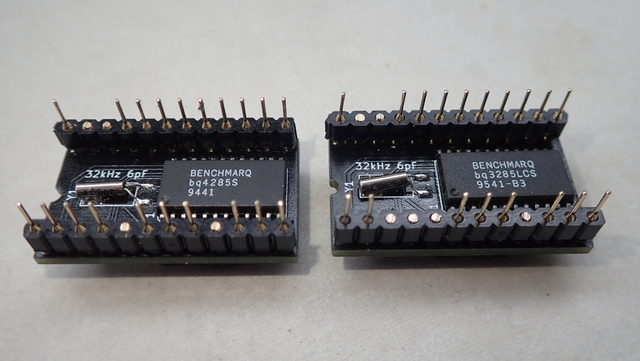

# Necroware's nwX287 RTC module

This is a drop-in replacement for RTC modules with solid body. Such modules were
widely used on 486 and Pentium mainboards back in the days. After so many years
the battery inside of such modules got empty and there is no way to exchange it.
With empty battery BIOS settings can not be saved and so many mainboards can't
even boot properly. This alternative solution has a socket for CR1225 and the
battery can be easily replaced again, when it gets empty. This module can be
used with BQ3285, BQ4285 or pin compatible RTC chips, dependent on the
requirements. This module was tested only with the named ICs, but it should be
also compatible with DS1385, which has additional 2KB of NVRAM and was used on
many microchannel and EISA mainboards.

This part should be compatible with following RTC modules:

* Dallas DS1287 / DS12887 / DS12B887 (using BQ3285)
* Dallas DS1387 (using DS1385, untested so far)
* Dallas DS14287 (using BQ4285)
* Benchmarq BQ3287 (using BQ3285)
* Benchmarq BQ4287 (using BQ4285)
* ODIN OEC12C887 (using BQ3285)
* VIA VT82887 (using BQ3285)

Video: https://www.youtube.com/watch?v=svPNxILeQEw

## Remarks to the used RTC chips

Pay attention, which RTC IC you need. Most of the mainboards with an RTC module
need BQ3285, but some EISA mainboards require BQ4285 with chip enable signaling
on pins 21/22 to control external memory. The Benchmarq ICs are easier to find
today, that's why they are proposed, but there are some compatible ICs existing
which can be used instead as well:

* Benchmarq BQ3285 = Dallas DS12885
* Benchmarq BQ4285 = Dallas DS14285

This module can be also used as a replacement for the Hitachi HD146818P RTC chip
which was not only used in many PC mainboards, but also in other devices and home
computers like the __BBC Master__. On some devices the pin 1 has to be pulled up
to pin 24 (VCC, Motorola Mode) or down to pin 12 (Ground, Intel Mode) using a 10k
resistor. This was tested by Adrian on his YT channel (he used a simple bodge wire,
but it's safer to use a resistor: https://youtu.be/2Sgleturods?t=2970)

## Cutting the module pins

*Important:* some mainboards seem to use /RCL pin 21, so cut it first if you are
sure, that your mainboard doesn't use it.

Dependent on which RTC chip you are using you have to cut off some pins on the
module. If you are using BQ3285, you need to remove pins 2,3,16,20,21,22. When
using BQ4285 you need to remove pins 2,3,16,20.

## Force Motorola / Intel mode

The BQ3285 and most of the compatible chips can work in two modes Motorola and
Intel. The Motorola mode was usually used on home computers with Motorola CPU
and on x86 compatible PCs used the Intel mode. The BQ3285 and most compatible
chips have auto detection feature for the mode. If pin 1 is pulled high, then
the chip will work in Motorola mode and if it is set to low, then the Intel
mode is selected. Unfortunately very old systems used original RTC chips, where
the pin 1 was floating and the chips were hard wired internally to be always
either in Motorola or Intel mode. On this nwX287 replacement module pin 1 on
the PCB is connected to the pin 1 of the chip, so the mode selection should
work, however if accordant connection on the mainboard is floating, the chip
will go into the default mode, which is Intel. That will be a problem on older
systems, which expect the chip to be in Motorola mode. Therefore an optional
jumper was introduced on the module to force a particular mode if needed. If
the module is not workin in your system, try to put a solder blob as required.

## Bill of Materials

Part | # | Description
-----|---|-----------------------------------------
U1   | 1 | Real-Time Clock BQ3285S or BQ4285S SO-24
Y1   | 1 | Crystal oscillator 32.768kHz 6pF
BT1  | 1 | CR1220 / CR1225 SMD battery holder

